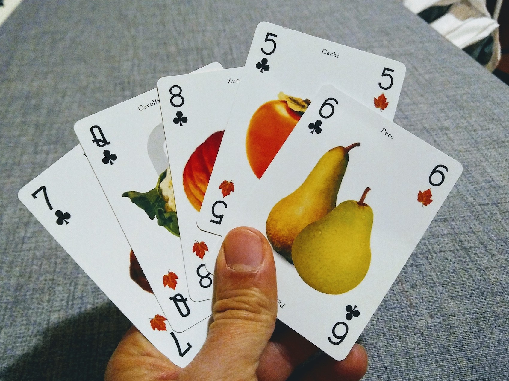
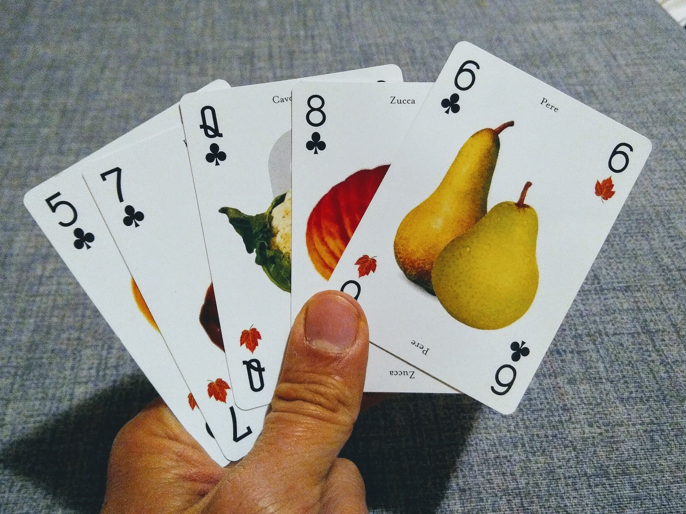
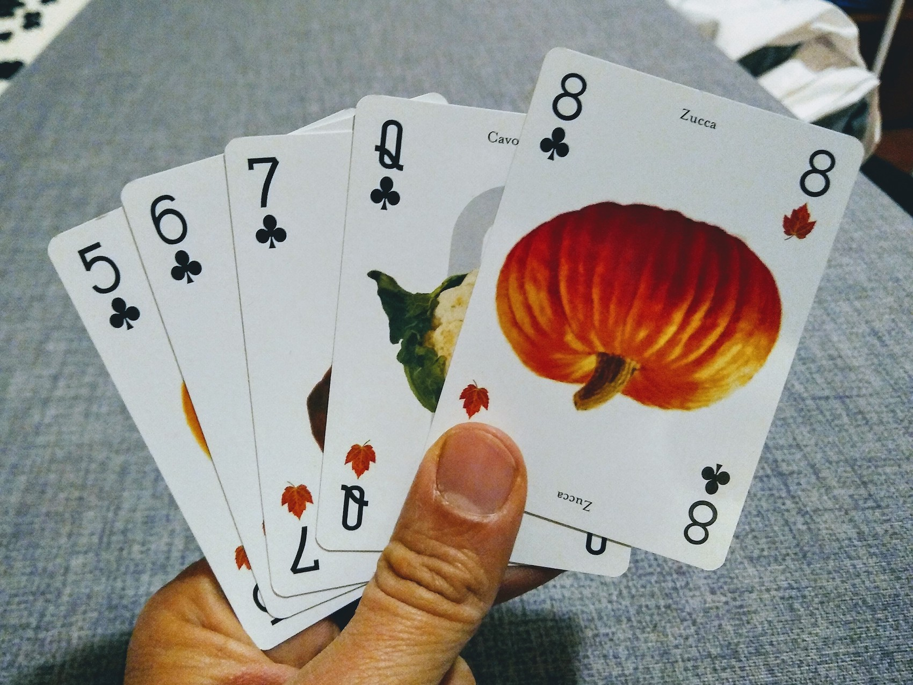
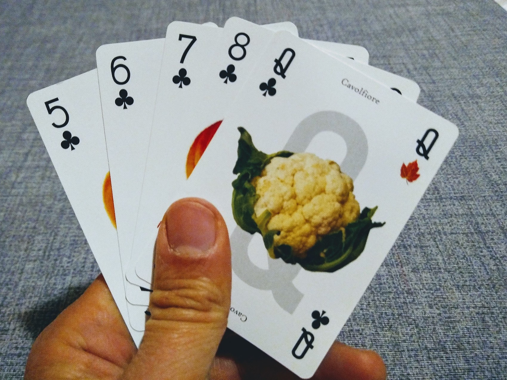
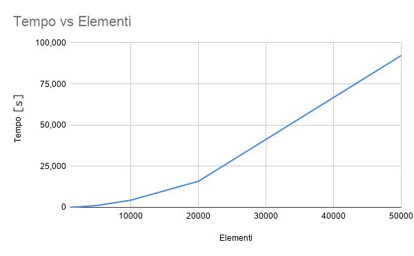

# Un primo algoritmo

Immaginiamo che ci vengano date cinque carte da gioco e ci venga chiesto di ordinarle.

<p class="centered">

</p>

Una possibile soluzione può essere quella di prendere la carta con il valore più basso, in questo caso il 5, e metterla all'inizio del mazzo.

<p class="centered">

</p>

Ripetiamo adesso l'operazione anche per le carte successive: mettiamo in ordine il 6...

<p class="centered">

</p>

Il 7 ce lo troviamo già nella posizione giusta, passiamo a sistemare l'8.

<p class="centered">

</p>

Anche la regina si trova già al suo posto e quindi siamo arrivati ad ordinare le nostre cinque carte.

## L'algoritmo
Proviamo ad implementare questo algoritmo con Python. 

Creiamo una lista di partenza con il valore delle carte del mio mazzo.

```py
cards = [7, 12, 8, 5, 6]
```

Ora creiamo una nuova lista vuota, che conterrà gli elementi ordinati.

```py
sorted_cards = []
```

Scorriamo tutta la lista originale e cerchiamo il valore più basso, quindi copiamolo nella nuova lista.

```py
min_val = min(cards)
sorted_cards.append(min_val)
```

OK, ora dobbiamo ripetere queste istruzioni per tutti gli elementi della lista originale.

```py
for _ in range(len(cards)):
    min_val = min(cards)
    sorted_cards.append(min_val)
```

Proviamo a vedere cosa succede se stampiamo la lista ordinata.

```py
>>> print(sorted_cards)
[5, 5, 5, 5, 5]
```

Abbiamo una lista della stessa lunghezza dell'originale, ma tutti gli elementi sono il valore minimo 🤔. In effetti, ogni volta che trovo un valore minimo lo devo togliere dalla lista originale, per evitare che venga trovato sempre quello! 

Il nuovo algoritmo diventa quindi così:

```py
for _ in range(len(cards)):
    min_val = min(cards)
    sorted_cards.append(min_val)
    cards.remove(min_val)
```

Se stampo il risultato ottengo:
```
>>> print(sorted_cards)
[5, 6, 7, 12, 18]
```

Bene, ha funzionato! Abbiamo creato il nostro primo algoritmo di ordinamento 😊.

Questo algoritmo di ordinamento ha un nome, si chiama _selection sort_ (ordinamento per selezione). È un algoritmo semplice ma efficace per liste di piccole dimensioni, come quella dell'esempio.

## Osservazioni
Se è così facile ordinare una lista, perché si parla tanto di ordinamento? Il fatto è che quando la lista cresce di dimensioni, le risorse necessarie per poterla ordinare possono crescere in maniera vertiginosa, rendendo nella pratica impossibile l'ordinamento stesso oppure molto svantaggioso.

Proviamo ad esempio ad usare il nostro algoritmo per liste di lunghezza diversa e calcoliamo il tempo che ci mette l'algoritmo per ordinare la lista. Il risultato è nella tabella che segue.

<p class="centered">

</p>

Nel grafico vediamo il tempo (in secondi) che ci mette l'algoritmo per ordinare liste di lunghezza 10000, 20000, 30000, 40000, 50000 elementi. Possiamo vedere che il tempo aumenta in modo non lineare, ovvero al raddoppiare degli elementi il tempo aumenta più del doppio. Facendo un'analisi un po' più approfondita, si può vedere che l'andamento è esponenziale, e in particolare il tempo aumenta come il quadrato degli elementi della lista: al raddoppiare degli elementi, il tempo aumenta di quattro volte.

Questo è un bel problema, perché se ho liste di milioni o miliardi di elementi, il tempo di ordinamento può schizzare a valori proibitivi. 

Per questo si cercano degli algoritmi più efficienti. Prima di andare avanti però è necessario dare una definizione della parola "efficiente".


