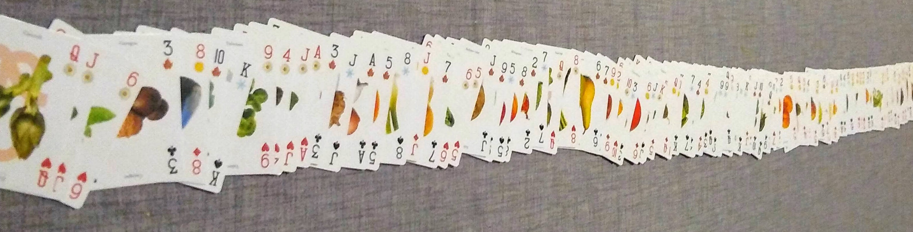
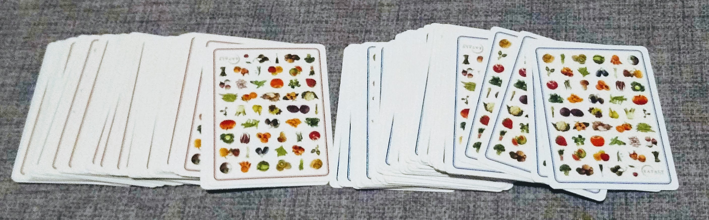
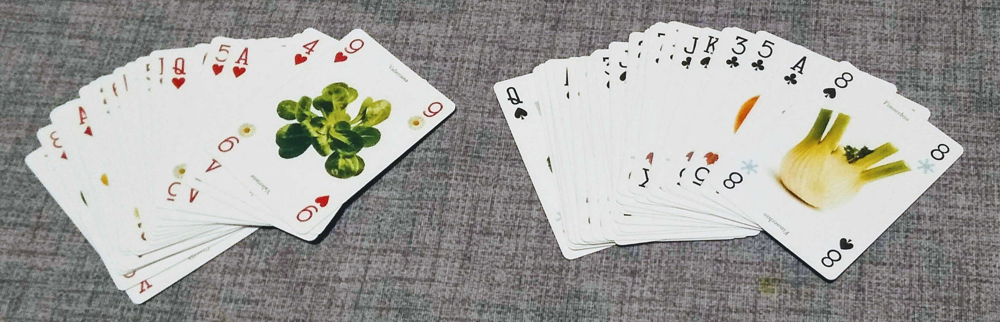
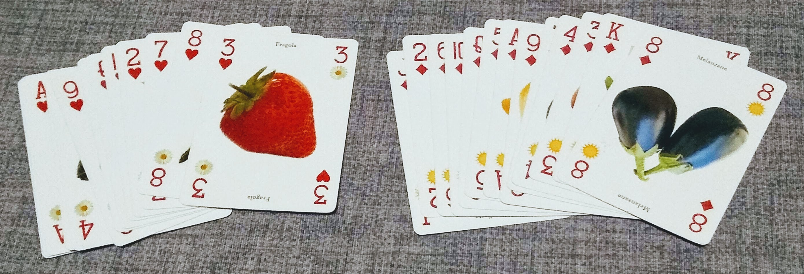
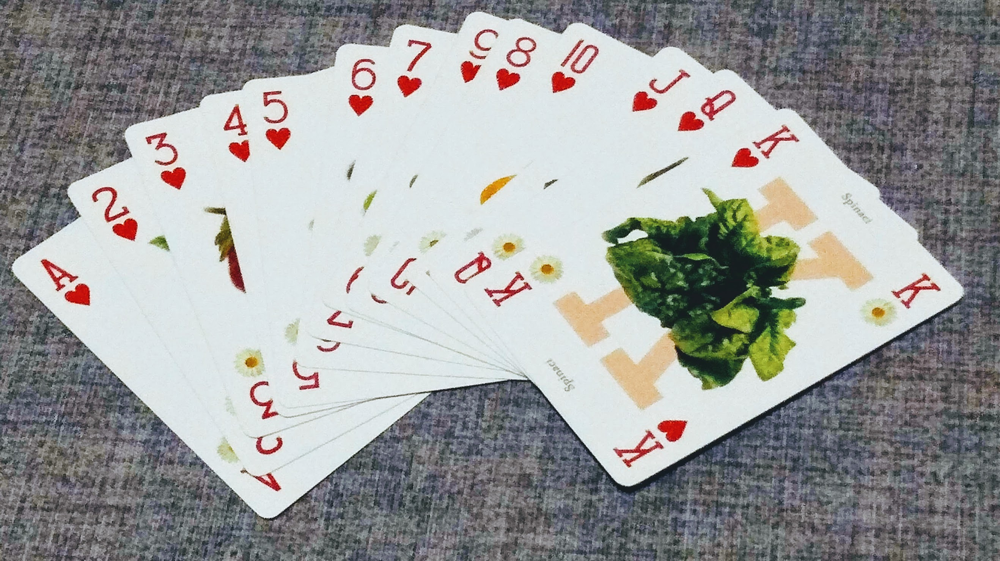

# Quick sort

Vediamo ora un ultimo algoritmo, il _quick sort_ (ordinamento veloce).
Rispetto agli altri algoritmi finora trattati, ha un caso medio molto migliore ed è quindi utilizzabile in casi reali anche per liste di grandi dimensioni.

Per capire l'idea di partenza, immaginiamo che ci venga chiesto di ordinare un mazzo di carte francesi da 104 carte.

Dobbiamo seguire queste regole:
- prima le carte con il dorso rosso, poi quelle con il dorso blu
- i semi devono essere in quest'ordine: cuori, quadri, fiori, picche
- per ogni seme, le carte devono essere messe in ordine crescente

Per ordinare le carte, potremmo fare così: scorro tutte le carte e metto a sinistra quelle con il dorso rosso, e a destra quelle con il dorso blu.

Prendo ora in esame le carte con il dorso rosso, metto a sinistra tutte quelle con il seme rosso e a destra quelle con il seme nero.

Ora prendo le carte con il seme rosso e metto a sinistra i cuori e a destra i quadri.

Prendo le carte di cuori e le ordino in modo crescente.

Ripetendo il procedimento per tutti gli altri mazzetti, riesco ad ordinare tutte le carte del mazzo

Questo tipo di approccio si chiama "dividi et impera": si dimostra che effettivamente è un metodo efficiente per ordinare liste di grandi dimensioni.

## Analisi dell'algoritmo
Verrà qui descritto l'algoritmo solo in modo concettuale, senza scendere nel dettaglio.

Per chi vuole approfondire si consigliano le seguenti risorse:
- https://visualgo.net/en/sorting
- http://sorting.at/

L'algoritmo di ordinamento quick sort prende un elemento della lista e lo imposta come _pivot_ (traducibile in italiano con "perno", "fulcro"). Sposto gli elementi della lista in modo tale che tutti gli elementi del pivot si trovino alla sua sinistra, e tutti gli elementi maggiori si trovino alla sua destra. Ottengo in questo modo due diverse sotto liste, proprio come mi accadeva con i mazzetti di carte. Ripeto quindi lo stesso procedimento per tutte le sotto liste, finché non arrivo ad ordinare tutti gli elementi.

Guardate tutto il seguente video per capire meglio il funzionamento. Nel video, il pivot è il ballerino con il cappello nero e inizialmente viene preso l'elemento più a sinistra della lista (o sottolista). Il ballerino con la decorazione nel cappello è invece l'elemento con cui si confronta il pivot.

<iframe width="560" height="315" src="https://www.youtube.com/embed/ywWBy6J5gz8" frameborder="0" allow="accelerometer; autoplay; encrypted-media; gyroscope; picture-in-picture" allowfullscreen></iframe>

## Calcolo complessità
Per calcolare la complessità, facciamo le seguenti considerazioni.

Ad ogni iterazione, devo confrontare il pivot con tutti gli elementi della lista, quindi ho un numero di operazioni pari a _n_.

Quante iterazioni devo fare? Nel caso medio posso considerare che il pivot finisca esattamente al centro (come capitava con il mazzo di carte) e che quindi ogni volta la lista si divida in due parti uguali. Devo quindi dividere per due finché non arrivo ad avere liste di un solo elemento.

Devo quindi trovare il numero di divisioni per il quale

 n/2/2/2/... = 1
 

Se chiamo _k_ il numero di volte che devo fare la divisione, l'espressione precedente si può anche scrivere come:

 n/2/2/2/... = n/2k = 1
 

Posso portare al numeratore k.

 n = 2k
 

Il numero k mi compare come esponente di 2. Come faccio a calcolare direttamente k? Per fortuna in matematica esiste la funzione inversa dell'esponenziale: si chiama _logaritmo_, lo vedrete l'anno prossimo in matematica. In ogni caso vi basti sapere che:

 k = log2(n)

Quindi, mettendo insieme i pezzi, devo fare log2(n) iterazioni ed ogni iterazione costa n operazioni. Il totale è quindi:

 complessità temporale quick sort caso medio = O(n*log2(n))

Bene, ce l'abbiamo fatta :)

### Caso peggiore
Quanto detto vale nel caso medio (che vale anche come caso migliore), nel quale la lista si divide sempre esattamente a metà. Questo non è sempre vero: se sono particolarmente sfortunato, potrebbe succedermi che il pivot invece di capitare al centro va a finire sempre ad un'estremità della lista, tutto a destra o tutto a sinistra.

Se mi capitasse questo caso, il numero di iterazioni che devo fare sarebbe circa il numero di elementi della lista, in quanto di fatto non sto dividendo realmente la lista, ma sto spostando il pivot tutto da un lato, come faceva il bubble sort. La complessità è pari a n iterazioni ognuna con n operazioni, ed ottengo un andamento come n2.

complessità temporale quick sort caso peggiore = O(n2)

Non posso fare in modo che questo caso peggiore non esista, ma la buona notizia è che posso fare in modo che sia molto improbabile scegliendo in modo opportuno l'elemento pivot. Un buon compromesso è quello di scegliere come pivot sempre l'elemento centrale della lista.

### Approfondimenti
Per una spiegazione più dettagliata ed esauriente guardatevi questo video.

<iframe width="560" height="315" src="https://www.youtube.com/embed/-qOVVRIZzao" frameborder="0" allow="accelerometer; autoplay; encrypted-media; gyroscope; picture-in-picture" allowfullscreen></iframe>

## Recap
| Quick sort | complessità temporale |
|-------------|:-----:|
| caso migliore | O(n*log2(n)) |
| caso peggiore | O(n2) |
| caso medio | O(n*log2(n)) |

## Esecuzione parallela
Come ultima nota, possiamo notare che una volta partizionata la lista in sotto-liste, l'ordinamento delle singole sotto-liste è indipendente.

Torniamo all'esempio delle carte: una volta divise le carte con il dorso rosso da quelle con il dorso blu, noi possiamo ordinare il primo mazzo e chiedere ad un amico di ordinare il secondo. Posso poi chiedere ad un altro amico di ordinare le carte con i semi neri mentre io ordino quelle con i semi rossi, e così via. Se gli amici sono collaborativi, ci metteremo molto meno.